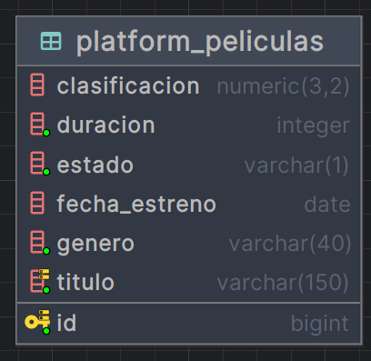

# API Películas

API REST desarrollada con **Spring Boot** para la gestión de películas. 
Esta aplicación permite realizar un **CRUD** de películas.

## 📌 Objetivo 
Ofrecer un servicio centralizado para la gestión de películas, permitiendo listar, 
crear, actualizar y eliminar registros.

## 🧑🏽‍💻 Entidades
La aplicación solo maneja la entidad
- **Movie:** Representa una película con atributos como título, género, estado y fecha de lanzamiento.

## 🚀 Funcionales 

### Movie
- `Get api/movies` - Lista todas las películas
- `Get api/movies/{id}` - Obtiene 1 película por su id
- `Post api/movies` - Crea una nueva película
- `Put api/movies/update/{id}` - Actualiza/Edita una película
- `Delete api/movies/delete/{id}` - Elimina una película

## ⚙️ Tecnologías utilizadas

- Java 21 
- Spring Boot
- Spring Data JPA
- PostgreSQL
- Gradle
- Docker

## 📂 Estructura del proyecto

```bash
src/main/java/com/platform/movies/
├── domain/        # Lógica de dominio (modelos, DTOs, excepciones, repositorios y servicios)
│   ├── dto/       # Clases DTO
│   ├── exception/ # Excepciones personalizadas
│   ├── repository/# Interfaces del dominio
│   └── service/   # Servicios de dominio
├── persistence/   # Capa de persistencia
│   ├── crud/      # Interfaces CRUD (JPA)
│   ├── entity/    # Entidades JPA
│   └── mapper/    # Mappers MapStruct
├── web/           # Capa web
│   ├── config/    # Configuraciones (Swagger, etc.)
│   ├── controller/# Controladores REST
│   └── exception/ # Manejo global de errores

```

## Base de datos
- PostgreSQL

## Diagrama (Tabla)

